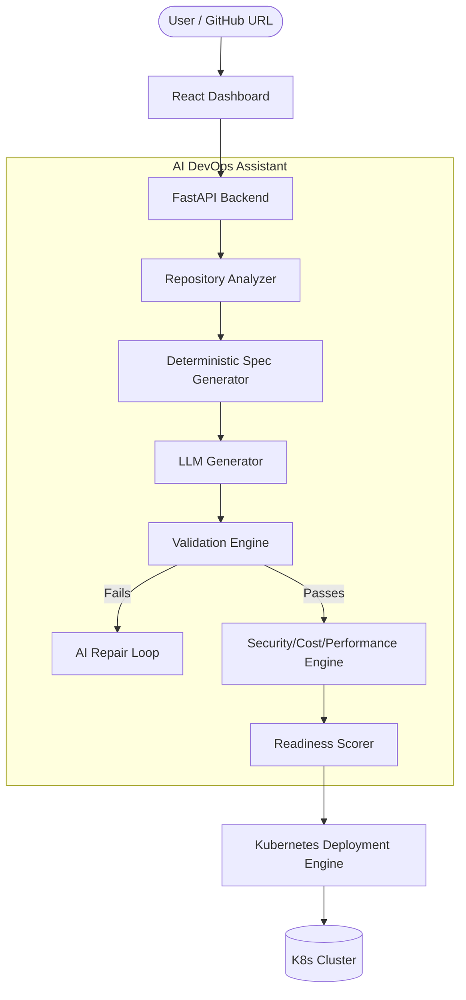

# System Architecture

```mermaid
graph TD
    User([User / GitHub URL]) --> UI[React Dashboard]
    UI --> Backend[FastAPI Backend]
    
    subgraph AI DevOps Assistant
        Backend --> Analyzer[Repository Analyzer]
        Analyzer --> Spec[Deterministic Spec Generator]
        Spec --> LLM[LLM Generator]
        LLM --> Validator[Validation Engine]
        Validator -- Fails --> Repair[AI Repair Loop]
        Validator -- Passes --> Analysis[Security/Cost/Performance Engine]
        Analysis --> Readiness[Readiness Scorer]
    end
    
    Readiness --> Deploy[Kubernetes Deployment Engine]
    Deploy --> Cluster[(K8s Cluster)]
```
