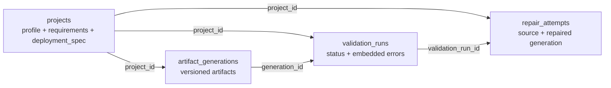

# MongoDB Document Model

The app stores repository profile, selected requirements, and the current
deployment specification together in one `projects` document. Versioned output
and workflow history use separate collections so each record can be queried and
indexed independently.

Indexes are created by the FastAPI startup lifecycle. Artifact versions are
unique per project; project history is indexed by project and creation time.
